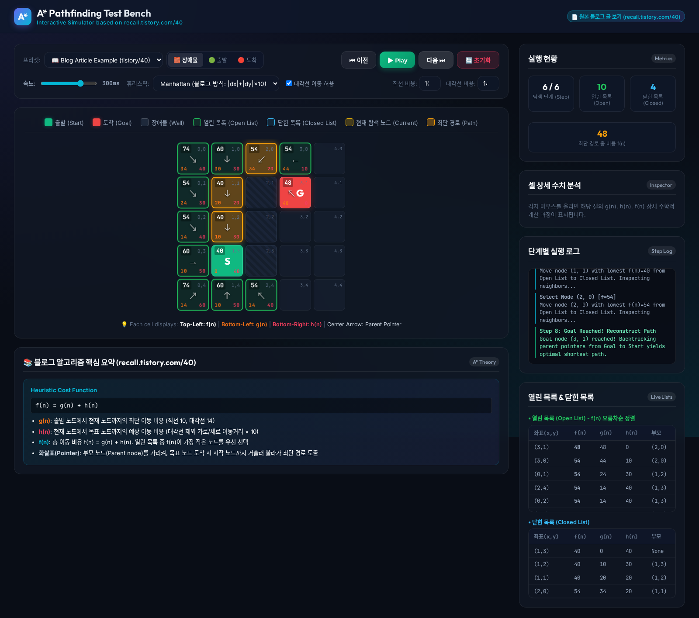
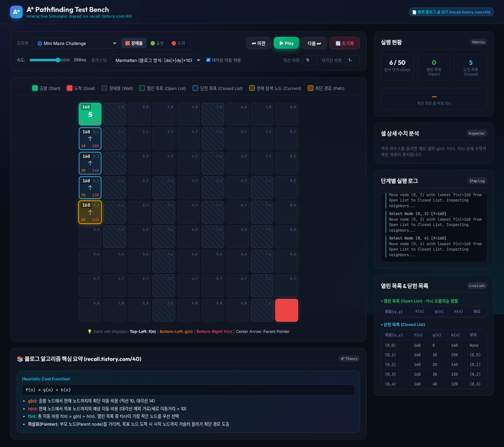

# 🧩 A* Pathfinding Algorithm Interactive Simulator & Test Bench

> 블로그 **[recall.tistory.com/40](https://recall.tistory.com/40)**의 **A* 알고리즘(A Star Algorithm)** 격자 지도 개념과 계산 공식을 바탕으로, 탐색 과정과 수식을 직접 테스트하고 검증할 수 있도록 제작된 로컬 인터랙티브 웹 시뮬레이터입니다.

---

## 📸 미리보기 (Screenshots)



*▲ 블로그 예제 프리셋 실행 화면: $f(n), g(n), h(n)$ 수치, 부모 노드 화살표, 단계별 로그, 열린/닫힌 목록 실시간 표시*



*▲ 미니 미로 챌린지 시뮬레이션 및 장애물 회피 경로 탐색*

---

## 💡 핵심 수식 및 알고리즘 원리 (blog/40 1:1 대응)

### 1. 비용 함수 (Heuristic Cost Function)
$$f(n) = g(n) + h(n)$$

* **$g(n)$ (좌하단 주황색 텍스트)**: 출발 노드에서 현재 노드 $n$까지의 최단 이동 비용
  * **직선 이동 (가로/세로)**: `10`
  * **대각선 이동**: `14` (피타고라스 정리 $\approx 10 \times \sqrt{2} = 14.14$에서 정수화)
* **$h(n)$ (우하단 빨간색 텍스트)**: 현재 노드 $n$에서 목표 노드까지의 예상 이동 비용 (**맨하탄 거리**, Manhattan Distance)
  * $h(n) = (|x_n - x_{goal}| + |y_n - y_{goal}|) \times 10$ (대각선 이동 제외)
* **$f(n)$ (좌상단 볼드 텍스트)**: 총 예상 비용. 열린 목록(Open List) 중 $f(n)$이 가장 작은 노드가 우선 탐색됩니다.
* **부모 포인터 화살표 (중앙)**: 각 셀 중앙에 위치하여 해당 셀의 **부모 노드(Parent Node)**를 시각적으로 가리킵니다. (목표 도착 시 시작점까지 역추적하여 최단 경로 도출)

---

## ✨ 주요 기능

* 📖 **블로그 예제 1-Click 재현 프리셋**: `recall.tistory.com/40` 글에 등장하는 5x5 격자 및 장애물 배치를 즉시 로드하고 단계별로 테스트.
* 🎮 **대화형 지형 에디터**: 마우스 클릭 및 드래그로 자유롭게 장애물(Wall) 설치, 출발지(Start) 및 도착지(Goal) 이동.
* ⏯ **단계별 타임라인 재생**: 재생/일시정지, 이전/다음 단계 이동, 속도 조절 슬라이더 ($50\text{ms} \sim 1000\text{ms}$).
* 🔍 **실시간 마우스 호버 분석기 (Inspector)**: 임의의 셀 위에 마우스를 올리면 $f(n) = g(n) + h(n)$ 상세 수식 및 부모 좌표 분해 표시.
* 📊 **열린 목록(Open List) & 닫힌 목록(Closed List) 실시간 테이블**: $f(n)$ 오름차순으로 정리된 후보 노드 및 탐색 완료 노드 추적.
* ⚙️ **알고리즘 옵션 커스텀**:
  * 휴리스틱 방식 변경 (Manhattan, Euclidean, Chebyshev)
  * 대각선 이동 허용 여부 토글
  * 직선/대각선 이동 비용 변경

---

## 🚀 로컬 실행 방법 (Quick Start)

### 필수 조건 (Prerequisites)
* Python 3.10 이상

### 1. 저장소 클론 및 이동
```bash
git clone https://github.com/kimminsu0519/A_star_algorithm.git
cd A_star_algorithm
```

### 2. 가상환경 생성 및 패키지 설치
```bash
# 파이썬 가상환경 생성
python3 -m venv .venv

# 가상환경 활성화 (Linux/macOS)
source .venv/bin/activate
# (Windows의 경우: .venv\Scripts\activate)

# 의존성 설치
pip install -r requirements.txt
```

### 3. 웹 서버 실행
```bash
python app.py
```

### 4. 웹 브라우저 접속
웹 브라우저를 열고 다음 주소로 접속합니다:
👉 **`http://127.0.0.1:8000`**

---

## 📁 프로젝트 구조 (Directory Structure)

```
A_star_algorithm/
├── app.py                 # FastAPI 기반 로컬 웹 서버
├── requirements.txt       # 파이썬 패키지 의존성 목록
├── docs/
│   └── images/            # README 프리셋 스크린샷 이미지
│       ├── preview_blog_example.png
│       └── preview_maze.png
└── static/                # 프론트엔드 정적 파일
    ├── index.html         # 메인 레이아웃 및 뷰 포트
    ├── css/
    │   └── style.css      # 다크 모드 다이내믹 디자인 시스템
    └── js/
        ├── astar.js       # A* 타임라인 스냅샷 알고리즘 엔진
        ├── presets.js     # 블로그 글 및 테스트 지형 프리셋
        └── app.js         # 프론트엔드 UI 인터랙션 및 시각화 컨트롤러
```

---

## 📝 참고 자료 (References)
* 원본 설명 블로그: [A* 알고리즘(A star algorithm) grid map 개념 및 구현 (recall.tistory.com/40)](https://recall.tistory.com/40)
